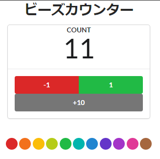

# react-use-countext-reducer-counter



下記サンプルソースを元に一部修正しました

https://github.com/oukayuka/Riakuto-StartingReact-ja3.1/tree/master/11-redux/05-use-reducer


* 修正点
  * containerコンポーネントとpresentationalコンポーネントを一つにまとめる

* 特徴
  * `useReducer(`)を利用することで、stateをReduxと同じ仕組みで管理できる
  * 親コンポーネントからstateとactionを子コンポーネントに渡す必要がある

    ⇒ このサンプルだと、普通にprop drillingと変わらない気がする
  * 別途`useContex()`を使い、子コンポーネントとstateとactionを共有すればいい

---
src/features/counter.ts

* redux toolkitを利用することで、驚くほどreducerが書きやすくなります。

createSlice()を利用すれば、Actionの定義と、reducerの値変更を一緒に行うことができます。

```typescript

```


