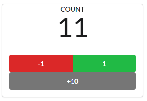
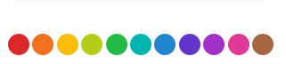

# react-use-countext-reducer-counter
## はじめに

状態を持ち、親子間で共有、変更するコンポーネントのサンプルです。
* propsで共有する代わりに、React hooksの`useContext`と`useReducer`を利用しています。
* reducerとactionsは実装がやや面倒なため、`redux toolkit`の`createSlice`を使い、まとめて実装しています。


  


* 機能
  * ボタンをクリックするとビーズが増えたり減ったりします
  * 親子間のstateは`Context`経由で渡します(useContext hookを利用)
  * ボタンクリックでは`useReducer()`を用い、action経由で更新します
    * reducerの実装を簡略化するため`redux toolkit`を使用します
  * コンポーネントを2つ配置することで、コンポーネント毎に状態の管理ができていることを確認します


### Contextとは

* プロパティを下に渡すことなく、コンポーネントツリー内でデータを渡す方法

親コンポーネント側で、Contextを作成し、引き渡す値を設定する

```typescript
export type CounterContextType = {
  state: CounterState;
  dispatch: React.Dispatch<AnyAction>;
};

export const CounterContext = createContext({} as CounterContextType);
 // ～～略～～
  <CounterContext.Provider value={{ state, dispatch }}>
    <CounterBoard />
    <ColorfulBeads />
  </CounterContext.Provider>
```

コンポーネント側でContexから値を受け取る事ができる

```typescript
const CounterBoard: VFC = () => {
  const {
    state: { count },
    dispatch,
  } = useContext(CounterContext);
  // ～～略～～
}
```


### createSliceとは

* action定義と、reducerによるstateの変更をひとつにまとめて実装ができる便利関数

createSliceを使う場合は、action、action creator、reducerをまとめて書くことができます

```typescript
export const counterSlice = createSlice({
  name: 'counter',
  initialState: { count: 0 }, // dummy value
  reducers: {
    added: (state, action: PayloadAction<number>) => ({
      ...state,
      count: state.count + action.payload,
    }),
    decremented: (state) => ({ ...state, count: state.count - 1 }),
    incremented: (state) => ({ ...state, count: state.count + 1 }),
  },
});
```
createSliceを利用しない場合は、action、action creator、reducerの3つが必要になります

* actions.ts
```typescript
export const CounterActionType = {
  ADD: 'ADD',
  DECREMENT: 'DECREMENT',
  INCREMENT: 'INCREMENT',
} as const;

type ValueOf<T> = T[keyof T];

export type CounterAction = {
  type: ValueOf<typeof CounterActionType>;
  amount?: number;
};

export const add = (amount: number): CounterAction => ({
  type: CounterActionType.ADD,
  amount,
});

export const decrement = (): CounterAction => ({
  type: CounterActionType.DECREMENT,
});

export const increment = (): CounterAction => ({
  type: CounterActionType.INCREMENT,
});

```

* reducer.ts

```typescript
import { Reducer } from 'redux'; // eslint-disable-line import/no-extraneous-dependencies
import { CounterAction, CounterActionType as Type } from './actions';

export type CounterState = { count: number };
export const initialState: CounterState = { count: 0 };

export const counterReducer: Reducer<CounterState, CounterAction> = (
  state: CounterState = initialState,
  action: CounterAction,
): CounterState => {
  switch (action.type) {
    case Type.ADD:
      return {
        ...state,
        count: state.count + (action.amount || 0),
      };
    case Type.DECREMENT:
      return {
        ...state,
        count: state.count - 1,
      };
    case Type.INCREMENT:
      return {
        ...state,
        count: state.count + 1,
      };
    default: {
      const _: never = action.type;

      return state;
    }
  }
};

```


## プログラム構造
```
├-index.tsx　　　　　　　　 ・・・Appを表示
├-App.tsx                 ・・・CounterWidget表示（2つ配置）
├-components
|  ├-ColorfulBeads.tsx    ・・・ビーズを表示
|  ├-CounterBoard.tsx     ・・・ボタンとCountを表示
|  └-CounterWidget.tsx　　・・・上記をまとめる。CounterContextで状態を保持
└-features
   └-couters.ts  ・・・reducer, actionの実装(redux toolkitのcreateSlice()を利用)
```

## ソース

### App.tsx

* `CounterWidget`を表示するコンポーネント(一方は初期値指定あり)
* コンポーネントを2つ配置することで、コンポーネント毎に状態の管理ができていることを確認する

```typescript
import { VFC } from 'react';
import styled from 'styled-components';

import CounterWidget from 'components/CounterWidget';

const CenterdDiv = styled.div`
  text-align: center;
`;

const App: VFC = () => (
  <CenterdDiv className="App">
    <header>
      <h1>ビーズカウンターuseContext, useReducer併用</h1>
    </header>
    <CounterWidget />
    <CounterWidget initialCount={3} />
  </CenterdDiv>
);

export default App;
```

### couters.ts

  * コンポーネントのstate(count)を保持する(reducerとaction定義)
  * redux toolkitの`createSlice()`を使い、actionとreducerを一緒に定義する
  * `createContext()`でContextを作成し、子孫コンポーネントへ`CounterContextType`を引き渡す

```typescript
import { createContext } from 'react';
import { createSlice, PayloadAction, AnyAction } from '@reduxjs/toolkit';

export type CounterState = { count: number };
export type CounterContextType = {
  state: CounterState;
  dispatch: React.Dispatch<AnyAction>;
};

export const CounterContext = createContext({} as CounterContextType);

export const counterSlice = createSlice({
  name: 'counter',
  initialState: { count: 0 }, // dummy value
  reducers: {
    added: (state, action: PayloadAction<number>) => ({
      ...state,
      count: state.count + action.payload,
    }),
    decremented: (state) => ({ ...state, count: state.count - 1 }),
    incremented: (state) => ({ ...state, count: state.count + 1 }),
  },
});

```

### CounterWidget.tsx

* CounterContext.Providerで囲い、子孫コンポーネントからContexへアクセスできるようにする
* `ColorfulBeads`コンポーネントと、`CounterBoard`コンポーネントを子として表示する

```typescript
import React, { VFC, useReducer } from 'react';
import { CounterContext, CounterState, counterSlice } from 'features/couters';

import ColorfulBeads from './ColorfulBeads';
import CounterBoard from './CounterBoard';

export const CounterWidget: VFC<{ initialCount?: number }> = ({ initialCount = 0 }) => {
  const [state, dispatch] = useReducer(
    counterSlice.reducer,
    initialCount,
    (count: number): CounterState => ({ count }),
  );

  return (
    <CounterContext.Provider value={{ state, dispatch }}>
      <CounterBoard />
      <ColorfulBeads />
    </CounterContext.Provider>
  );
};

export default CounterWidget;
```


### CounterBoard.tsx

* 現在のカウント表示と、カウント変更ボタンを表示するコンポーネント

  

* ボタンクリック時、actionを呼び出してstateを更新する
* stateは、`useContext()`経由で取得する
* actionを呼び出すために必要な`dispatch`も`useContext()`経由で取得する

```typescript
import { VFC, useContext } from 'react';
import { Button, Card, Statistic } from 'semantic-ui-react';

import { CounterContext, counterSlice } from 'features/couters';

const BULK_UNIT = 10;

const CounterBoard: VFC = () => {
  const {
    state: { count },
    dispatch,
  } = useContext(CounterContext);

  const { added, decremented, incremented } = counterSlice.actions;

  return (
    <Card className="centered">
      <Statistic>
        <Statistic.Label>count</Statistic.Label>
        <Statistic.Value>{count}</Statistic.Value>
      </Statistic>
      <Card.Content>
        <div className="ui two buttons">
          <Button color="red" onClick={() => dispatch(decremented)}>
            -1
          </Button>
          <Button color="green" onClick={() => dispatch(incremented)}>
            1
          </Button>
        </div>
        <div className="fluid-button">
          <Button fluid color="grey" onClick={() => dispatch(added(BULK_UNIT))}>
            +{BULK_UNIT}
          </Button>
        </div>
      </Card.Content>
    </Card>
  );
};

export default CounterBoard;
```


### ColorulBeads.tsx

* 現在のカウント数分、ビーズを表示するコンポーネント

  

* CounterContextから受け取ったstateが更新されると、ビーズを再描画する

```typescript
import { VFC, useContext } from 'react';
import { Container, Label, SemanticCOLORS } from 'semantic-ui-react';
import styled from 'styled-components';

import { CounterContext } from 'features/couters';

// ～～～途中略～～～

const ColorfulBeads: VFC = () => {
  const {

    state: { count },
  } = useContext(CounterContext);

  return (
    <ContainerWithMgn>
      {range(count).map((n) => (
        <Label key={n} circular color={colors[n % colors.length]} />
      ))}
    </ContainerWithMgn>
  );
};

export default ColorfulBeads;
```

## 参考
下記ソースを参考にさせていただきました。

https://github.com/oukayuka/Riakuto-StartingReact-ja3.1/tree/master/11-redux/05-use-reducer

[りあクト！](https://oukayuka.booth.pm/) ← Reactを学ぶなら最高の本です
